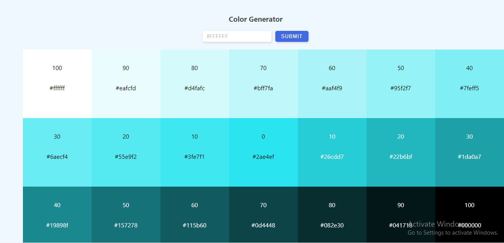
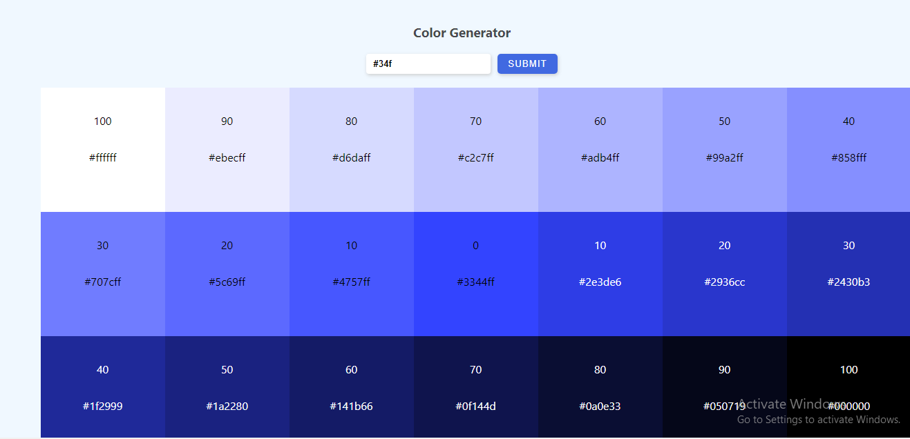
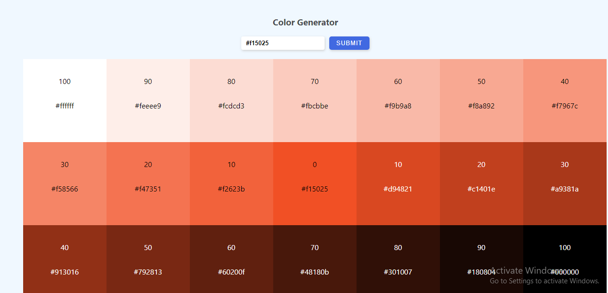
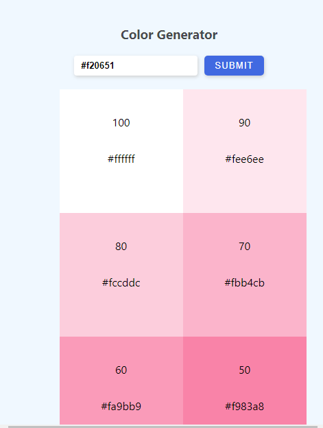

# Color-Generator
Complete Another Minor project during the course of Learning react 

The Color Generator web app is another minor project developed to aid my 
understandng of how to make use of the react library, this web app makes use 
of the Value.js library to generate arrays of colors divided into tint and shades
and this colors are then iterated over and then used as background color. user enters only 
an hex string color format and a total of twenty weighted color is display.

below is picture of what is generated

